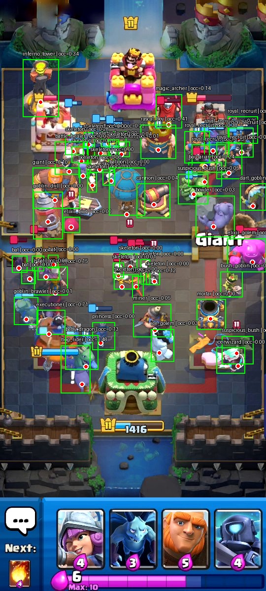
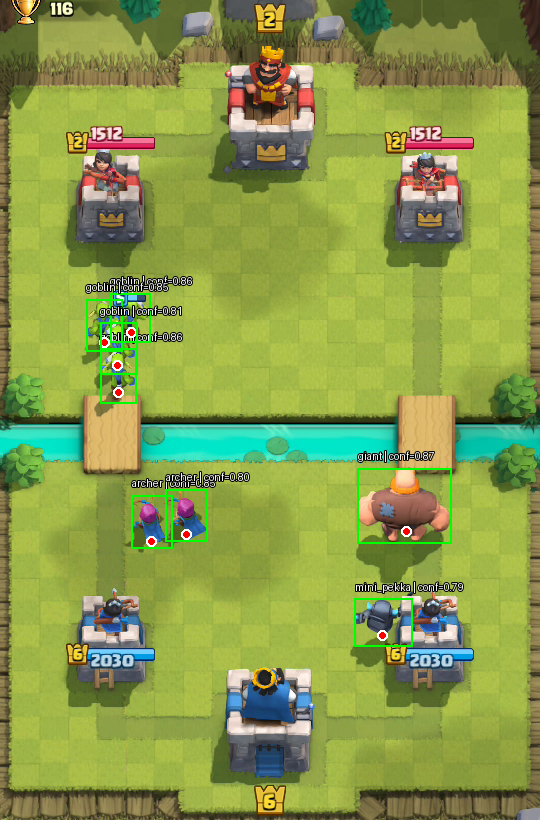

# jamCR

This project creates synthetic Clash Royale scenes and labeled YOLO pose data
from game sprites and arena assets. Each labeled troop or building has a
bounding box and a keypoint marking its world anchor, providing training data
for pose detection models.

## Examples

Synthetic scene with generated labels:



Model predictions on a real game image:




## Setup

The project requires Python 3.12 or newer. [uv](https://docs.astral.sh/uv/)
is recommended:

```bash
uv sync
cp .env.example .env
```

Set `CLASH_ASSETS_DIR` in `.env` to the asset repository directory. It must
contain `troops.json`, `buildings.json`, `towers/`, `arenas/`, and the sprite
directories referenced by the metadata:

```dotenv
CLASH_ASSETS_DIR=/absolute/path/to/clash_assets
```

The dataset-builder scripts load `.env` from the repository root, so this works even when a script is launched from another directory.

## Generate a synthetic dataset

Run the dataset builder from the repository root:

```bash
uv run python dataset_builder/dataset_builder.py
```

It writes YOLO pose images, labels, and `data.yaml` to `dataset/`. By default,
it generates 10,000 training images, 1,000 validation images, no test images,
and up to 200 negative training examples from a local `negatives/` directory.
The default test split is empty. Adjust the constants in
`dataset_builder/dataset_builder.py` for smaller development runs.

**Warning:** each run recreates the configured output directory (`dataset/`
by default), replacing any existing contents.

To inspect the arena coordinate system:

```bash
uv run python dataset_builder/show_coordinates.py
```

## Dataset-builder files

- `asset_manager.py` — loads sprite images and troop/building metadata from
  the configured external assets.
- `augmentations.py` — defines the image and sprite augmentation settings.
- `benchmark_models.py` — generates the frozen synthetic test set and
  evaluates YOLO pose models against real and synthetic test data.
- `camera.py` — converts between arena world coordinates and image pixels.
- `config.py` — loads the asset-directory setting and validates its path.
- `constants.py` — defines tower placements, arena restrictions and troop
  swarm settings.
- `dataset_builder.py` — generates cropped images, YOLO pose labels and
  dataset configuration files.
- `effects.py` — implements sprite appearance effects used during rendering.
- `generator.py` — builds random scenes by placing troops, buildings, towers
  and arena details.
- `renderer.py` — composites scenes, applies augmentations and creates
  bounding-box and keypoint labels.
- `scene.py` — defines scene, asset, sprite and label data structures.
- `show_coordinates.py` — creates an image showing the arena coordinate grid.
